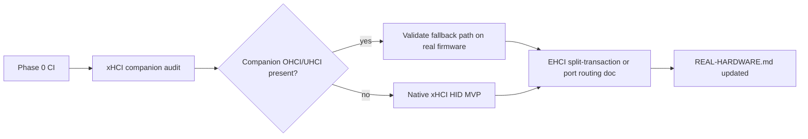

# Eve OS — action plan

This document turns the issue inventory in [`todo.md`](todo.md) into a **sequenced plan**: what to do first, what depends on what, and how to know a phase is done. It assumes the primary audience is **x86_64 guests and bare-metal PCs**, with AArch64 and Pi work following shared abstractions.

For live capability status see [`WhatsWorking.md`](WhatsWorking.md). For phase completion percentages see [`PHASE-STATUS.md`](PHASE-STATUS.md). For the full backlog see [`todo.md`](todo.md).

---

## Goals

1. **Usable browser on real hardware** — keyboard, pointer, and Ethernet on common PC configurations (not only QEMU VirtIO + PS/2).
2. **Reliable page fetch** — HTTP/1.x bodies complete without hanging on modern servers (chunked encoding, sane timeouts).
3. **Honest UI** — no chrome that looks broken (back/forward, fake Wi‑Fi scan, toggles with no backend).
4. **Maintainable multi-platform path** — one shared core for `gfx`, `net`, and input HALs instead of three divergent kernels.
5. **Regression safety** — CI and documented smoke commands so BIOS vs UEFI and ARM paths do not silently rot.

---

## Principles

- **Fix what users touch first** — browser fetch and input beat new protocols (HTTP/3, IPv6, Wi‑Fi).
- **One concrete driver at a time** — e.g. finish vmxnet3 *or* bge, not “all NICs.”
- **Hide or ship** — SYS rows and toolbar buttons must either work or be clearly disabled; no silent no-ops.
- **Docs track reality** — update platform docs in the same PR as behavior changes.
- **No big-bang rewrite** — extend `kernel/` and shared `arm_run` incrementally; decide HAL boundaries before duplicating stacks.

---

## Phase 0 — Foundation (1–2 weeks)

Low-risk work that unblocks everything else and stops doc drift.

| # | Action | Primary files | Done when |
|---|--------|---------------|-----------|
| 0.1 | Add GitHub Actions workflow running `./scripts/verify-repo.sh` on push/PR | `.github/workflows/verify.yml` (new) | CI green on `main` for all workspace targets |
| 0.2 | Fix stale platform narrative in `utm/TODO-PLATFORMS.md` | `utm/TODO-PLATFORMS.md` | Intro reflects shared `arm_run` on RPi + ARM UEFI |
| 0.3 | Add per-image feature matrix | `utm/BUILT-IMAGES.md`, `utm/SETUP-ALL-DEVICES.md` | Each image lists input, net, persist, storage |
| 0.4 | Document regression commands | new section in `utm/SETUP-ALL-DEVICES.md` or `scripts/` README | Copy-paste QEMU commands for net + HID smoke |
| 0.5 | Run and record x86 BIOS vs UEFI smoke | test notes in repo or issue template | Both `eve-bios.img` and `eve-uefi.img` pass same checklist |

**Exit criteria:** CI exists; docs match code; anyone can run a documented 10-minute smoke test on x86.

---

## Phase 1 — Browser & network reliability (2–4 weeks)

Highest ROI for “pages that load” without new hardware drivers.

| # | Action | Depends on | Done when |
|---|--------|------------|-----------|
| 1.1 | **Decode HTTP chunked bodies** | — | Sites using `Transfer-Encoding: chunked` render or fail with a clear error, not infinite load |
| 1.2 | **Browser history or honest chrome** | — | Back/forward either navigate a small in-memory stack *or* buttons are hidden/disabled in `gfx.rs` |
| 1.3 | **Improve TLS time source** | timer HAL (minimal: read UEFI runtime or ACPI RTC if present) | Certs with sane `notBefore`/`notAfter` validate on hardware with firmware clock |
| 1.4 | **Tighten URL / href policy** | — | Documented blocklist for `javascript:`, `data:`, etc.; mixed-content behavior explicit in docs |
| 1.5 | **Static IP octet editing in SYS** | — | User can set all four octets for IP, gateway, DNS without recompiling |

**Defer in this phase:** HTTP/2, QUIC, cookies, WebSockets, IPv6.

**Exit criteria:** Default Shrine URL and 2–3 chunked-encoding test sites load in QEMU; toolbar behavior matches implementation.

---

## Phase 2 — x86 input on modern PCs (4–8 weeks)

Unblocks bare-metal laptops and towers where PS/2 and legacy USB companions are absent.



| # | Action | Notes | Done when |
|---|--------|-------|-----------|
| 2.1 | Audit xHCI → companion routing | `kernel/src/xhci.rs` | Log which backend attaches; test Q35 + `-device qemu-xhci` with companion |
| 2.2 | **Native xHCI HID MVP** | keyboard + one boot mouse, interrupt IN | Input works on xHCI-only QEMU profile without OHCI/UHCI |
| 2.3 | EHCI: implement or document | `kernel/src/ehci.rs` | Either minimal split-transaction HID *or* explicit “use companion” failure mode in SYS |
| 2.4 | Real-hardware validation | `install/REAL-HARDWARE.md` | At least one xHCI-only machine tested; input path documented |

**Exit criteria:** Built-in keyboard works on one xHCI-only target (QEMU minimum; hardware preferred).

---

## Phase 3 — Settings, persistence & polish (2–3 weeks)

| # | Action | Done when |
|---|--------|-----------|
| 3.1 | **x86 settings persistence** | Home URL, bookmarks, IP mode survive reboot (UEFI NVRAM and/or small ESP file) |
| 3.2 | Label or remove placeholder SYS rows | Wi‑Fi scan shows “demo”; Bluetooth/HDA marked unsupported or hidden |
| 3.3 | **AArch64 reboot/shutdown** | `kernel/src/power/stub.rs` calls UEFI `ResetSystem` where safe; document Apple panic behavior |

**Exit criteria:** x86 UEFI guests retain settings after reboot; no misleading “connected” Wi‑Fi UX.

---

## Phase 4 — HAL & shared core (ongoing, start after Phase 1)

Architectural work that reduces cost of Pi and ARM UEFI features.

| # | Action | Unblocks |
|---|--------|----------|
| 4.1 | **Decide kernel layout** | ADR or section in `utm/TODO-PLATFORMS.md`: monolith vs `kernel` lib + thin platform bins |
| 4.2 | **Framebuffer trait** | Single `gfx` blit path for x86 GOP, Pi mailbox, UEFI GOP |
| 4.3 | **Timer trait** | TCP timeouts, USB poll cadence, TLS wall clock |
| 4.4 | **Bus discovery trait** | x86 PCI, Pi MMIO, UEFI protocols |

**Rule:** No new platform-specific copy of `html`, `net`, or `gfx` until 4.1 is written.

---

## Phase 5 — Platform networking (after Phase 4.2+)

Pick **one** hardware path per milestone.

| Milestone | Target | Action |
|-----------|--------|--------|
| 5a | VMware / ESXi guests | Finish **vmxnet3** TX/RX completion path (`kernel/src/vmxnet3.rs`) |
| 5b | Apple / Broadcom towers | **bge/tg3** bring-up *or* document “use USB Ethernet + supported chip” |
| 5c | Pi 4 bare metal | **GENET** driver + device-tree or mailbox init |
| 5d | Pi 3 / USB dongles | USB host stack + one common USB-Ethernet MAC |

**Exit criteria per milestone:** DHCP + HTTP fetch to Shrine on that platform.

---

## Phase 6 — Storage (optional, large)

Only after browser + input + one extra NIC path are stable.

| # | Action | Scope |
|---|--------|-------|
| 6.1 | AHCI read-only or VirtIO-only policy | Document whether Eve will ever boot from SATA |
| 6.2 | NVMe / USB mass storage | New project if required; not mixed into driver fixes |

**Default recommendation:** defer general storage; keep VirtIO-blk install path as the only disk story for now.

---

## Phase 7 — Web platform expansion (long horizon)

Explicitly **out of scope** until Phases 1–3 are done. Track in `todo.md`, do not schedule yet.

- HTTP/2 / HTTP/3 / QUIC  
- Cookies, sessions, WebSockets, downloads  
- Full CSS (flex/grid) or ECMAScript engine  
- iframe/object, WebAssembly, plugins  
- 802.11 MAC + WPA, Bluetooth HCI  
- IPv6  

If scripting returns, extend **`eve-script:` VM** (`kernel/src/script_runtime.rs`) before attempting a full JS engine.

---

## Suggested execution order (summary)

```
Phase 0  →  CI + docs + smoke matrix
Phase 1  →  chunked HTTP + toolbar + TLS clock + static IP UI
Phase 2  →  xHCI HID (native or proven companion)
Phase 3  →  x86 persist + honest SYS + AArch64 power
Phase 4  →  HAL traits (framebuffer, time, bus)
Phase 5  →  one NIC per milestone (vmxnet3 → GENET → …)
Phase 6  →  storage (optional)
Phase 7  →  full web platform (defer)
```

---

## Metrics & review

Review this plan when:

- A phase **exit criteria** is met (check off in PR description).
- A **real-hardware** test changes priority (e.g. xHCI-only laptop becomes daily driver target).
- A **security** issue appears in TLS, URL parsing, or HTML rendering.

| Metric | Target |
|--------|--------|
| `verify-repo.sh` | Passes on every PR |
| QEMU x86 smoke | Shrine HTTPS load < 30 s on documented command |
| xHCI input | Keyboard + pointer in Q35 profile without legacy USB |
| Doc drift | No open item in `todo.md` “Testing, CI & docs” after Phase 0 |

---

## Related documents

| Document | Role |
|----------|------|
| [`PHASE-STATUS.md`](PHASE-STATUS.md) | Phase completion % and item checklist |
| [`todo.md`](todo.md) | Full issue backlog |
| [`WhatsWorking.md`](WhatsWorking.md) | Current feature snapshot |
| [`utm/TODO-PLATFORMS.md`](utm/TODO-PLATFORMS.md) | Platform parity matrix |
| [`install/REAL-HARDWARE.md`](install/REAL-HARDWARE.md) | Bare-metal constraints |
| [`utm/BROWSER-LIMITS.md`](utm/BROWSER-LIMITS.md) | Rendering and JS expectations |

---

*Derived from [`todo.md`](todo.md). Update [`PHASE-STATUS.md`](PHASE-STATUS.md) and both files when priorities shift or a phase completes.*
